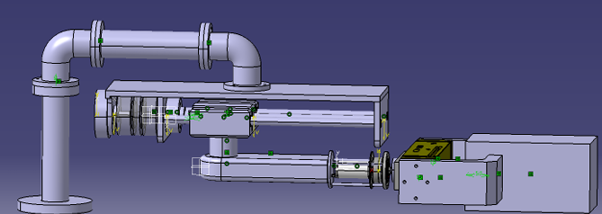
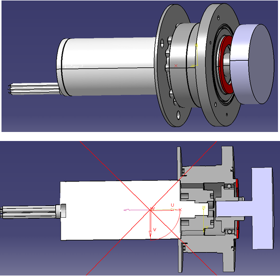
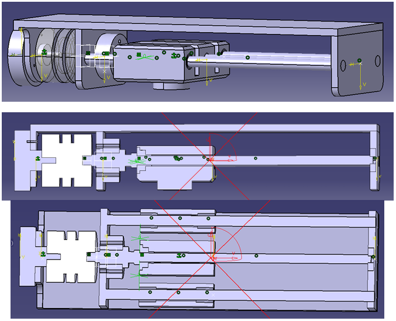
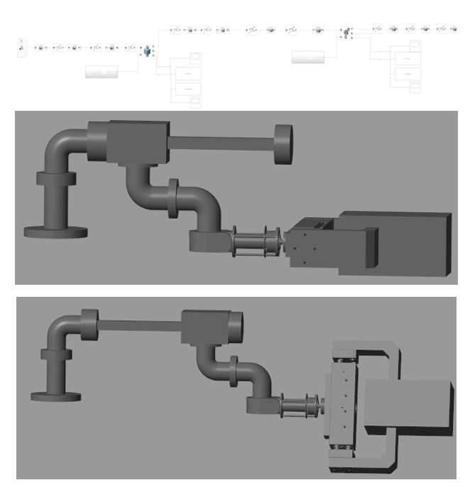
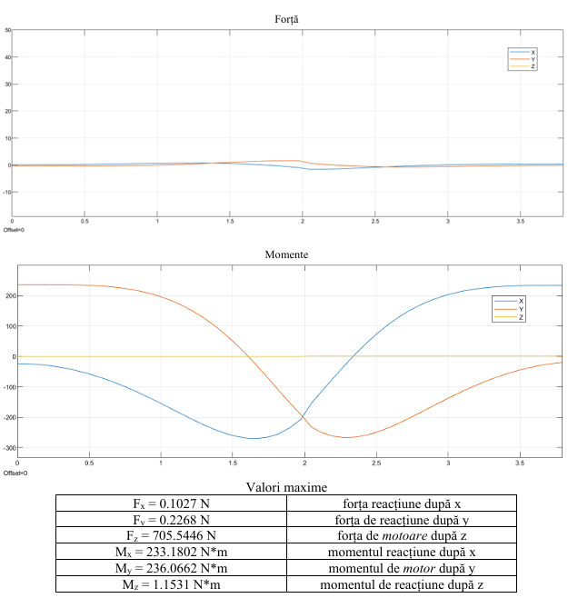
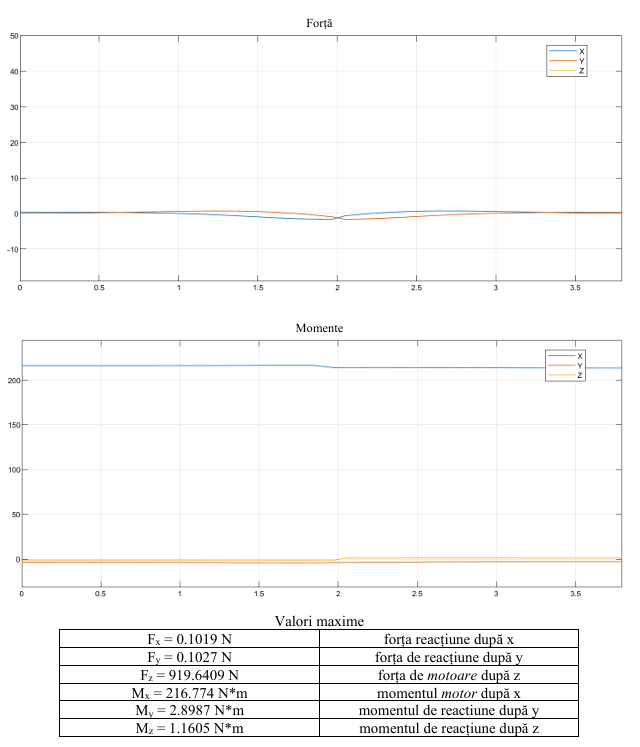

# Industrial Manipulator Design (2-module translation + rotation)

> Design of a 2-module fixed robot with a translation and a rotation axis, from requirements and calculations to component selection and a CATIA V5 model.

**Context:** Robot Design course, Transilvania University of Brasov  
**Tools:** CATIA V5, MATLAB/SimMechanics

## Overview

The goal was to design a fixed manipulator that carries a steel part from one position to another with a given precision and service life. The work covers kinematic and dynamic sizing of both modules, selection of standard components from manufacturer catalogues, and the 3D model and technical report.

## What I did

- Designed two modules: a **translation module** (270 mm stroke) and a **rotation module** (255° total angle).
- Sized the actuation from the required speeds and accelerations and from the load, then verified the choice with a dynamic simulation of the mechanism (MATLAB/SimMechanics).
- Selected standard components: parallel gripper (Schunk PSH 42-100), harmonic drive (HFUC series, ratio 100), servomotors (Maxon), ball screw nut (SFB, 16 mm diameter, 5 mm pitch), elastic couplings, bearings and linear rolling guides.
- Modelled all parts and assemblies in CATIA V5 and documented every step in a technical report.

## Key specifications

| Parameter | Value |
|---|---|
| Payload | 47.75 kg steel part (150 x 270 mm) |
| Translation module | 270 mm stroke, 180 mm/s, 75 mm/s² |
| Rotation module | 255°, 170 °/s, 65 °/s² |
| Positioning precision | ±0.05 mm |
| Required service life | 10 000 h |

## Images

<!-- Image 1: Full assembly render, isometric view. -->

   
  <em>3D model of the complete manipulator in CATIA V5</em>

<!-- Image 2: Close-up of rotation module -->

   
  <em>Detail of rotation module</em>

<!-- Image 3: Close-up of translation module -->

   
  <em>Detail of the translation module</em>

<!-- Image 4: Screenshot of the simulation -->

   
  <em>Simulation</em>

<!-- Image 5: Screenshot of torque/force plot for rotation -->

   
  <em>Force/Torque plot for rotation</em>

<!-- Image 6: Screenshot of torque/force plot for translation -->

   
  <em>Force/Torque plot for translation</em>

## Files

- [Technical report (PDF)](technical-report-robotic-manipulator.pdf)

## Notes

Verified by calculation and simulation; not manufactured or tested on a physical prototype.
