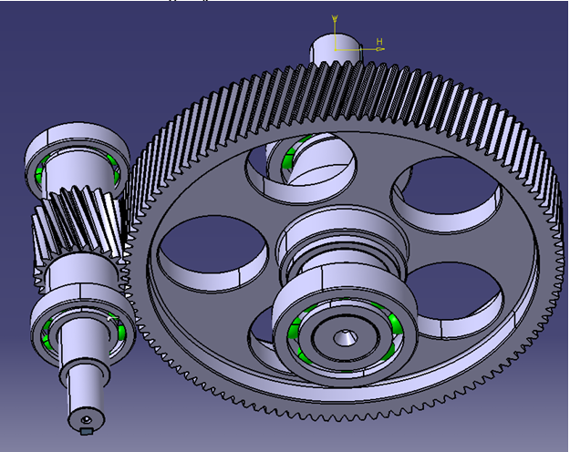
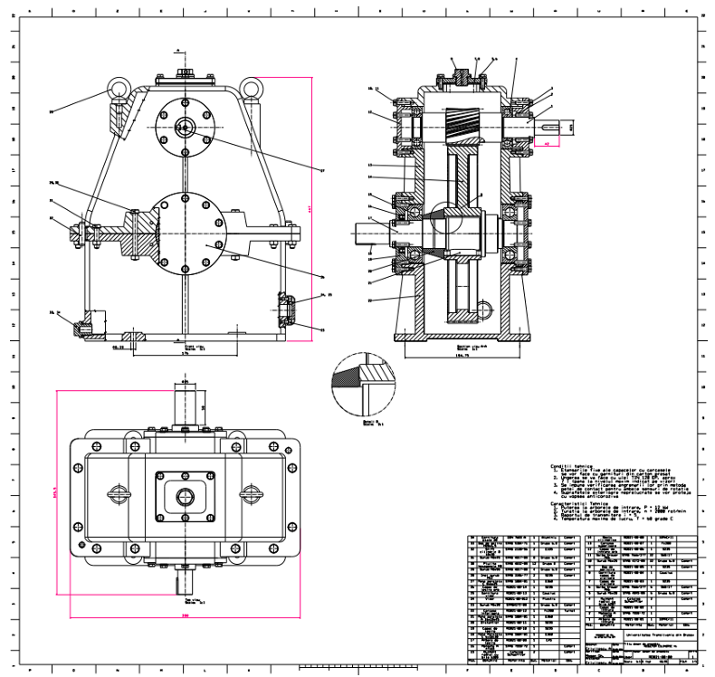
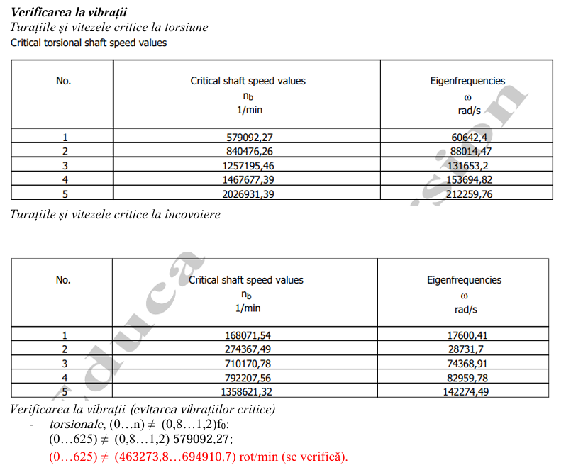

# Single-Stage Helical Gearbox

> Complete design of a single-stage helical gearbox: gear sizing, shafts, bearings and keys, shaft verification and a CATIA V5 model with drawings.

**Context:** Machine Elements course, Transilvania University of Brasov  
**Tools:** CATIA V5, MDESIGN

## Overview

The gearbox transmits a given power between an input and an output shaft at a fixed ratio and service life. The work follows the full design path of a machine-element project: material choice, gear geometry, shaft and bearing selection, key checks, verification and 3D modelling.

## What I did

- Chose a case-hardened alloy steel (18MnCr11) and sized the helical gears (normal module 2.5 mm).
- Reached the imposed centre distance of 180 mm with a **positive profile shift** (reference centre distance 178.585 mm).
- Dimensioned the input and output shafts, selected ball bearings and checked parallel keys.
- Verified the shafts in MDESIGN (static and fatigue safety, deflection, critical speeds).
- Produced the 3D model, assembly drawing and workshop drawings in CATIA V5.

## Key specifications

| Parameter | Value |
|---|---|
| Power / input speed | 12 kW at 2000 rpm |
| Gear ratio | 5 |
| Required service life | 7000 h |
| Gear material | 18MnCr11, case-hardened |
| Centre distance | 180 mm |

## Images

<!-- Image 1: Isometric render of the assembly. Save as images/01-assembly.png -->

*Gearbox assembly in CATIA V5*

<!-- Image 2: One drawing sheet or a cross-section of the assembly. Save as images/02-drawing.png -->

*Sectioned view or workshop drawing*

<!-- Image 3: Screenshot of safety factors or the shaft diagram. Save as images/03-mdesign.png -->

*Shaft verification output from MDESIGN*

## Files

- [Technical report (PDF)](./technical-report.pdf)

## Notes

Verified by calculation and software checks; not manufactured or tested.
