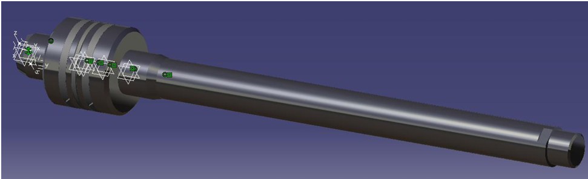
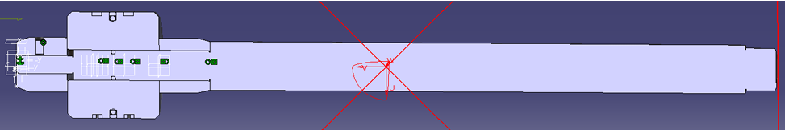
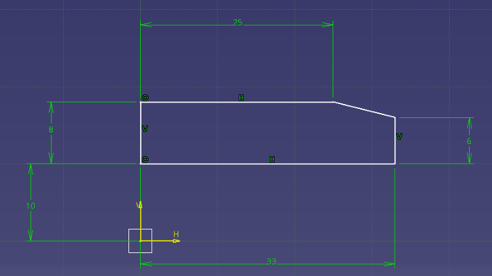

# Hydraulic Cylinder

> Design of a double-acting hydraulic cylinder for a load moved along an inclined path, with a CATIA V5 model of its parts and assembly.

**Context:** University project, Transilvania University of Brasov  
**Tools:** CATIA V5

## Overview

A hydraulic cylinder had to move a mass along a 45° inclined direction. The work covers sizing of the main elements, selection of standard seals and guide rings from catalogues, and 3D modelling of the parts and the moving assembly.

## What I did

- Dimensioned the piston rod and checked it against buckling, and sized the cylinder bore and wall thickness.
- Computed the flow rates for both strokes and sized the hydraulic lines.
- Computed the energy to be absorbed by the end-of-stroke cushioning.
- Selected standard O-rings, piston seal and guide rings from catalogues.
- Modelled the rod, piston, front and rear bushings, pin and sealing elements, and assembled the moving core in CATIA V5.

## Key specifications

| Parameter | Value |
|---|---|
| Moved mass / incline | 450 kg at 45° |
| Stroke | 280 mm |
| Bore / rod diameter | 80 mm / 32 mm |
| Rod material | OLC 45 steel |

## Images

<!-- Image 1: Render of the moving core. Save as images/01-piston-rod.png -->

   
  <em>Piston and rod assembly in CATIA V5</em>

<!-- Image 2: Section through the piston and seals. Save as images/02-section.png -->

   
  <em>Section view of the assembly</em>

<!-- Image 3: A single part drawing. Save as images/03-bushing.png -->

   
  <em>Front bushing drawing</em>

## Files

- [Technical report (PDF)](./technical-report.pdf)

## Notes

Verified by calculation and 3D modelling; not manufactured or tested.
