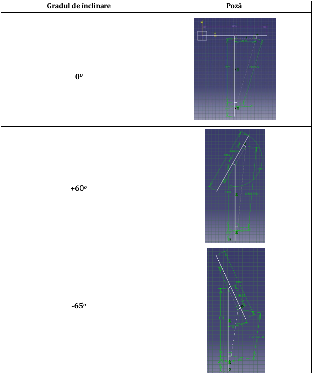
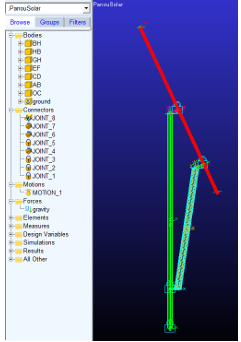
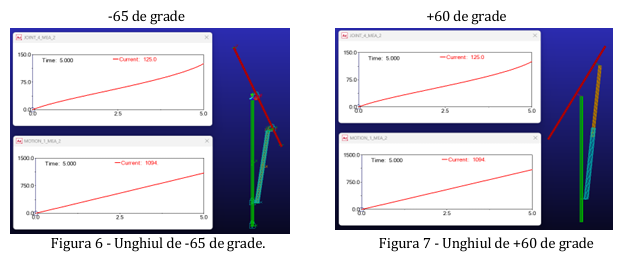

# Photovoltaic Panel Orientation System

> Kinematic design of a tilting mechanism for a solar panel driven by a linear actuator, with motion simulation in Adams View.

**Context:** Mechatronic Systems course, Transilvania University of Brasov  
**Tools:** CATIA V5, Adams View

## Overview

The mechanism tilts a PV module between two limit angles using a linear actuator. The work determines the geometry and the actuator stroke, selects a commercial actuator and simulates the motion to confirm the angles and the stroke.

## What I did

- Set up the mechanism geometry in CATIA V5 for three positions (0°, +60°, -65°) on a 2200 mm post.
- Measured the required actuator lengths (about 1252.8 mm to 2346.7 mm, roughly 1094 mm of stroke) and selected a 12 V linear actuator whose retracted and extended lengths cover that range.
- Built the kinematic model in Adams View (bodies, joints, motion) and simulated the full stroke to reach both limit angles.
- Defined a stepwise actuator control profile, with the panel positioned around midday, when radiation peaks.

## Key specifications

| Parameter | Value |
|---|---|
| Module | 400 W, 1855 x 1029 x 30 mm, 20.8 kg |
| Tilt range | +60° / -65° |
| Support post height | 2200 mm |
| Actuator | 12 V, 700 N rated, 15 mm/s, 1252-2352 mm length |

## Images

<!-- Image 1: Sketch of 0°, +60° and -65°. Save as images/01-positions.png -->

*Mechanism in the three positions (CATIA V5)*

<!-- Image 2: Screenshot of the mechanism with joints. Save as images/02-adams-model.png -->

*Adams View model*

<!-- Image 3: Actuator stroke plot or the model at the end angles. Save as images/03-simulation.png -->

*Simulation result*

## Files

- [Technical report (PDF)](./technical-report.pdf)

## Notes

The analysis is kinematic. The actuator force and structural loads (wind, weight) were not analysed.
