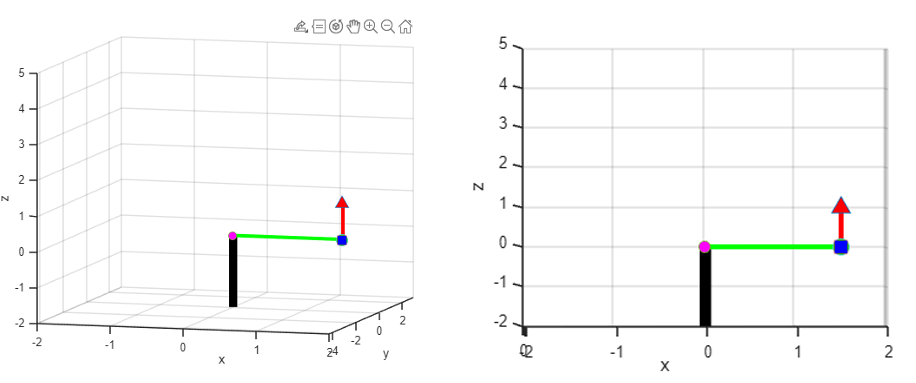
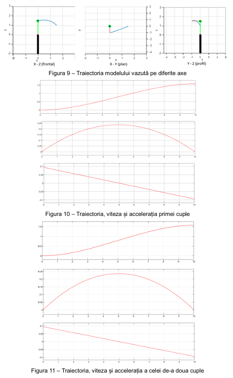

# 2-DOF Robot Arm: Geometric, Kinematic and Dynamic Modelling

> Complete mathematical model of a serial arm with two degrees of freedom, implemented and simulated in MATLAB and Simulink, with motor selection from the simulated torques.

**Context:** Robot Dynamics course, Transilvania University of Brasov  
**Tools:** MATLAB 2024b, Simulink

## Overview

The arm has the joint sequence Ry(q1) - Tx(l1) - Rx(q2) - Tz(l2). The work builds the geometric, kinematic and dynamic models, validates them with simulation and uses the resulting torques to select motors.

## What I did

- Derived the geometric model with homogeneous transformations (position and orientation of every joint and of the end effector).
- Derived the kinematic model (linear and angular Jacobians) and simulated joint and end-effector velocities.
- Derived the dynamic model with two methods, **Lagrange-Euler** (inertia, Coriolis/centrifugal and gravity terms) and **Newton-Euler** (kinematic and dynamic recursions).
- Simulated the arm in Simulink and extracted joint torques, forces and moments over the trajectory.
- Selected a brushless motor (Maxon EC 90 flat) for the more loaded joint and used the same motor on both joints.

## Key specifications

| Parameter | Value |
|---|---|
| Link lengths | l1 = 1500 mm, l2 = 1000 mm |
| Peak joint torques | about 0.07 N·m (joint 1), 0.99 N·m (joint 2) |
| Joint speed | about 0.236 rad/s (2.25 rpm) |

## Images

<!-- Image 1: 3D plot of the arm in the initial position. Save as images/01-geometric-model.png -->

*Geometric model in MATLAB*

<!-- Image 2: Plot of the trajectory and one velocity graph. Save as images/02-kinematics.png -->

*End-effector trajectory and joint velocities*

<!-- Image 3: Simulink diagram plus a torque plot. Save as images/03-simulink-torque.png -->

*Simulink model and torque curves*

## Files

- [Technical report (PDF)](./technical-report.pdf)

## Notes

The study is a model-based simulation; mechanical design, gearing and control of the arm are not covered.
