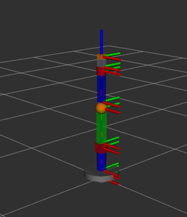
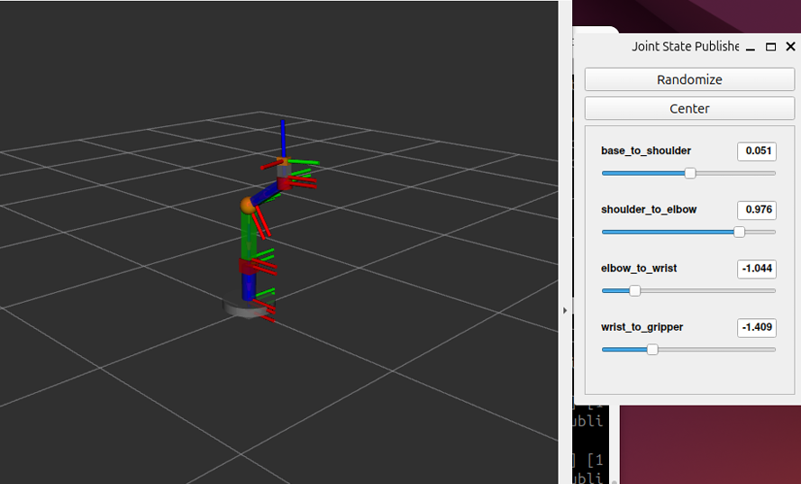
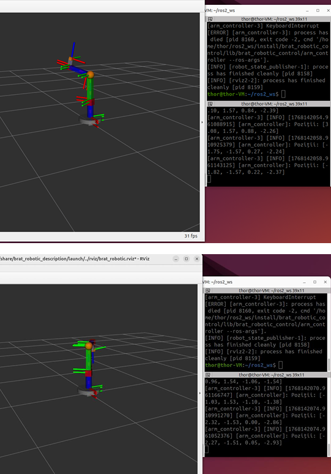

# Robotic Arm Model and Controller (ROS 2)

> A 10-link, 4-DOF robotic arm described in URDF, with a Python ROS 2 node that drives all moving joints and a launch file for RViz2.

**Context:** Robot Programming course, Transilvania University of Brasov  
**Tools:** ROS 2 Jazzy, URDF, RViz2, Python (rclpy), colcon

## Overview

The assignment was to build a robot model with at least 10 components, of which at least 4 move, where the motion is produced by a node you write and publish on a topic. The workspace is split into two ROS 2 packages and runs on Ubuntu in a VMware virtual machine.

## What I did

- `brat_robotic_description` (ament_cmake): the URDF model with 10 links and 4 moving joints (two continuous, two revolute with ±1.57 rad limits).
- `brat_robotic_control` (ament_python): the `arm_controller` node publishes `sensor_msgs/JointState` on `/joint_states` every 50 ms with sinusoidal commands for each joint.
- A launch file starts `robot_state_publisher`, RViz2 and the controller together.
- Built with colcon; the model was first checked interactively with joint sliders in `urdf_tutorial`.

## Key specifications

| Parameter | Value |
|---|---|
| ROS 2 distribution | Jazzy |
| Links / moving joints | 10 / 4 |
| Publish rate | 20 Hz |
| Packages | 2 (description and control) |

## Images

<!-- Image 1: Screenshot with the robot visible. Save as images/01-rviz-arm.png -->

*The arm in RViz2*

<!-- Image 2: Screenshot of the Joint State Publisher window. Save as images/02-sliders.png -->

*Joint sliders (URDF check)*

<!-- Image 3: Terminal showing the published joint positions. Save as images/03-launch-output.png -->

*Launch output*

## Files

- [Technical report (PDF)](./technical-report.pdf)

## Notes

This is a visual model: it has no physics, collision or inertia data, and the commands are demonstration motions, not a feedback controller. Gazebo and ros2_control would be the natural next steps.
