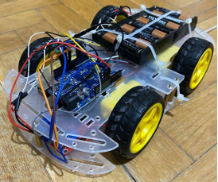
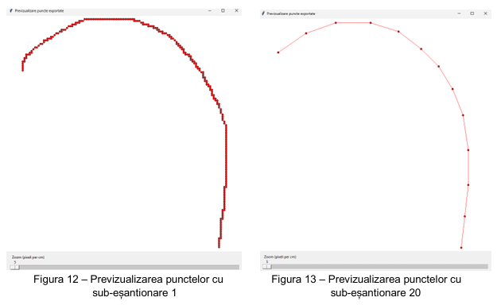
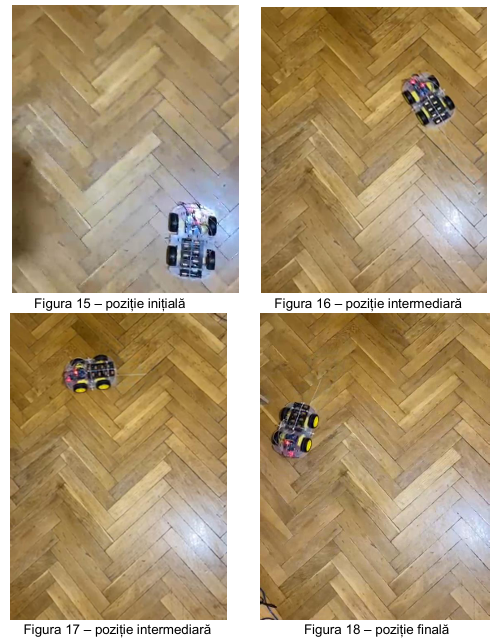

# Mobile Robot with Trajectory Interface

> A 4-wheel differential-drive robot that follows predefined and user-drawn trajectories using wheel encoders, proportional control and odometry.

**Context:** Mobile Robots course, Transilvania University of Brasov  
**Tools:** Python (Tkinter), C/C++ (Arduino IDE)

## Overview

The project has two parts. First, the robot follows a fixed trapezoid path from encoder pulse counts. Second, a Python GUI lets the user draw any trajectory, exports its points, and the robot executes them as a sequence of rotations and straight segments.

## What I did

- Assembled the robot from a 4-motor kit with an Arduino Uno, an L298N motor driver, optical wheel encoders and an 8 x AA battery pack.
- Converted rotations and distances into encoder ticks with calibrated correction factors and executed a right-trapezoid path.
- Built a **Python/Tkinter GUI** to draw a trajectory with the mouse, subsample the points, set the pixel-to-cm scale, preview the result and export it for Arduino (header file) and as CSV.
- Implemented point-to-point navigation: compute heading and distance to the next point, rotate, drive straight with a **proportional (P) correction** between the left and right sides, and update the pose with odometry.
- Solved hardware issues along the way (unsuitable encoder sensors, loose connectors, motor axis vibrations, weak battery supply).

## Key specifications

| Parameter | Value |
|---|---|
| Platform | Arduino Uno, L298N, 4 DC motors |
| Feedback | Wheel encoders, 20 ticks per revolution |
| Wheel diameter | 6.5 cm |
| Control | P control (Kp about 0.7), integral and derivative disabled |

## Images

<!-- Image 1: Photo of the robot from above. Save as images/01-robot.png -->

*The assembled robot*

<!-- Image 2: Screenshot with a drawn path and the preview of exported points. Save as images/02-gui.png -->

*The trajectory GUI*

<!-- Image 3: Photo or collage of the start, middle and end positions. Save as images/03-execution.png -->

*Execution of a trajectory*

## Files

- [Technical report (PDF)](./technical-report.pdf)

## Notes

Control is proportional only and position is estimated by odometry, so error accumulates over long paths; adding sensors or a full PID would be the next step.
